## ✦ Sobre mim

Sou estudante de **Ciência da Computação**, com interesse em **UI/UX e desenvolvimento**.

Gosto de explorar como a tecnologia pode transformar ideias em soluções digitais funcionais.

## ✦ Interesses em Tecnologia

  

`Python` • `JavaScript` • `PostgreSQL` `UI/UX Design` • `Design de Interfaces`

 

